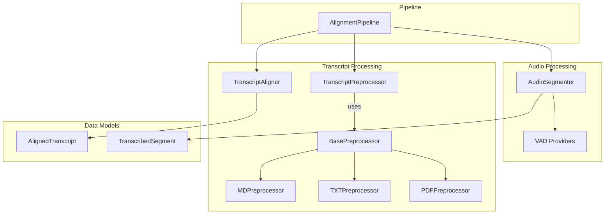

# Component Interaction Diagram

This diagram shows how the main components of the system interact with each other.

## Component Descriptions

### Pipeline
- `AlignmentPipeline`: Main orchestrator that coordinates the entire alignment process

### Audio Processing
- `AudioSegmenter`: Handles audio file segmentation and transcription
- `VAD Providers`: Different Voice Activity Detection implementations

### Transcript Processing
- `TranscriptPreprocessor`: Manages different transcript format preprocessing
- `TranscriptAligner`: Aligns transcribed segments with human transcripts
- Various preprocessor implementations for different formats

### Data Models
- `TranscribedSegment`: Represents a transcribed audio segment
- `AlignedTranscript`: Represents an aligned transcript segment 