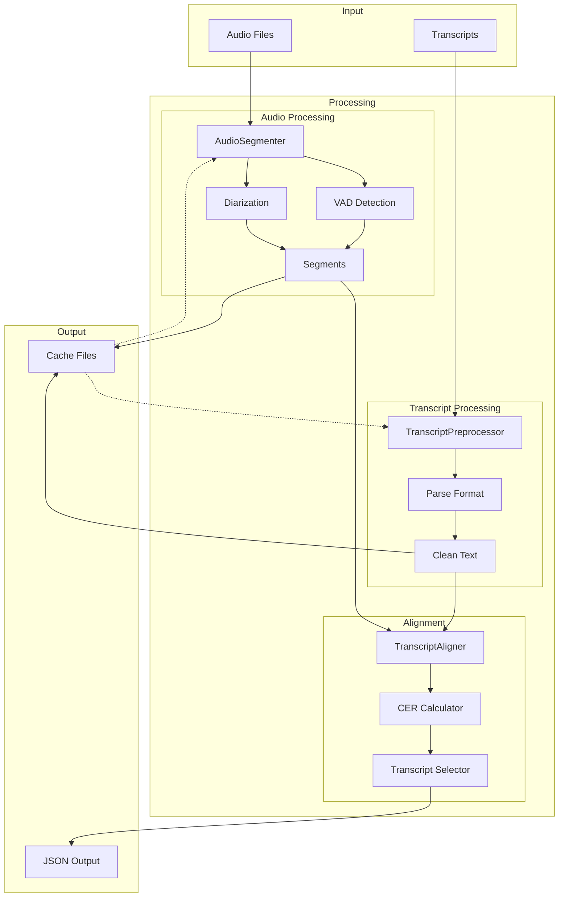

# Data Flow Diagram

This diagram shows how data flows through the system during the alignment process.

## Data Flow Description

### Input Stage
- Audio files (various formats)
- Transcript files (various formats)

### Processing Stage

#### Audio Processing
1. Audio segmentation
2. Voice activity detection
3. Speaker diarization
4. Segment creation

#### Transcript Processing
1. Format detection and parsing
2. Text cleaning and normalization
3. Preprocessing based on format

#### Alignment
1. Segment alignment
2. CER calculation
3. Best transcript selection

### Output Stage
- JSON files with alignments
- Cache files for intermediate results

## Caching Strategy

The system implements two types of caching:
1. **Persistent Cache**: For expensive operations like audio segmentation
2. **Temporary Cache**: For intermediate results during processing

Cache invalidation is based on:
- Input file changes
- Configuration changes
- Time-based expiration 