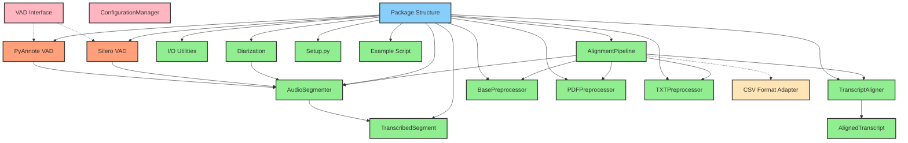

# Implementation Status Diagram

This diagram shows the current status of different components in the system.

## Status Legend

- 🟢 **Implemented**: Components that have been implemented and moved to the new structure
- 🔵 **In Progress**: Components currently being worked on
- 🔴 **Not Started**: Components that need to be created but haven't been started
- 🟡 **TBD**: Components that require further discussion/specification
- 🟠 **Needs Refactoring**: Components that work but need architectural improvements

## Component Status Details

### Implemented Components (🟢)
- `TranscribedSegment`: Moved to data_models/models.py (direct move)
- `AlignedTranscript`: Moved to data_models/models.py (direct move)
- `AudioSegmenter`: Moved to audio_processing/segmenter.py (fixed missing imports for `silence` and `tqdm`)
- `TranscriptAligner`: Moved to transcript/aligner.py (direct move)
- `I/O Utilities`: Moved to utils/io.py (direct move)
- `Diarization`: Created in audio_processing/diarization.py (extracted from main.py)
- `Setup.py`: Created in root directory with all required dependencies
- `Example Script`: Created new example in examples/basic_alignment.py
- `BasePreprocessor`: Implemented in transcript/preprocessor/base.py
- `PDFPreprocessor`: Implemented in transcript/preprocessor/pdf_preprocessor.py
- `TXTPreprocessor`: Implemented in transcript/preprocessor/txt_preprocessor.py
- `AlignmentPipeline`: Implemented in pipeline/alignment_pipeline.py

### Needs Refactoring (🟠)
- `PyAnnote VAD`: Currently returns a pipeline object instead of detection results
- `Silero VAD`: Returns results directly, creating inconsistency with PyAnnote VAD
  - **Note**: These components need a common interface to be truly modular

### In Progress Components (🔵)
- `Package Structure`: Basic directory structure created and main components implemented

### Not Started Components (🔴)
- `ConfigurationManager`: For managing settings
- `VAD Interface`: Common interface needed for all VAD implementations

### To Be Determined (🟡)
- `CSV Format Adapter`: Need more flexible CSV processing to handle different parliament dataset formats

## Key Changes Made

1. **Fixed Components**:
   - Added missing `from pydub import silence` import in AudioSegmenter
   - Added missing `from tqdm import tqdm` import in AudioSegmenter
   - Fixed progress bar implementation in segment_and_transcribe method
   - Modified `segment_audio` to use Silero VAD directly for non-speech detection

2. **Structural Changes**:
   - Separated VAD implementations into modular components
   - Extracted diarization initialization to standalone module
   - Created proper package structure with __init__.py files

3. **New Components**:
   - Created example script for demonstrating library usage
   - Added setup.py for package installation
   - Created comprehensive documentation and diagrams
   - Implemented transcript preprocessor system with base class and two concrete implementations
   - Implemented alignment pipeline with two-level selection process

## VAD Inconsistency Issue

There's currently an architectural inconsistency between the VAD implementations:

1. `initialize_vad_pipeline()` returns a **VAD pipeline object** that:
   - Is initialized once
   - Is passed to AudioSegmenter
   - Is called to get speech regions

2. `get_silero_vad()` returns the **detection results** directly:
   - Is called each time detection is needed
   - Reinitializes the model on each call
   - Returns the non-speech regions

This inconsistency should be resolved by designing a common VAD interface that all implementations follow, likely with:
- A consistent initialization method
- A consistent detection method 
- Common return types

## CSV Processing Limitations

The current CSV processing implementation in `AlignmentPipeline` has some limitations:
- Basic URL parsing that may not work for all parliamentary websites
- Limited ability to handle diverse CSV formats with different column structures
- No configuration options for mapping different CSV schemas

A more robust approach might include:
- Configurable column mapping
- Enhanced URL parsing for different parliament websites
- Support for custom extraction logic for different datasets

## Next Steps

1. Design and implement a common VAD interface
2. Add configuration management system
3. Create unit tests for all components
4. Add proper logging throughout the library
5. Enhance CSV processing to handle more formats
6. Create more examples of pipeline usage 