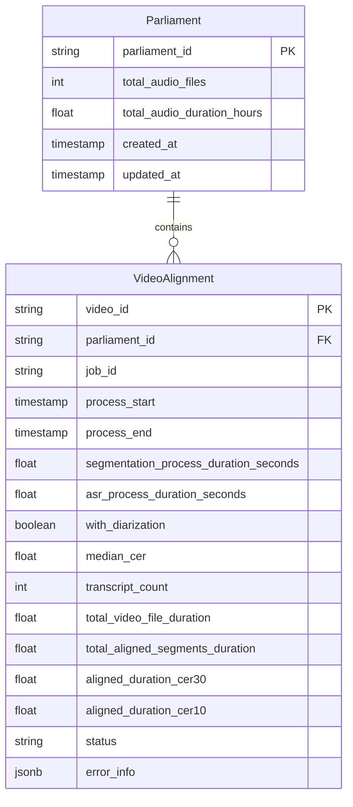

# Improved Logging Architecture for Parliament Transcript Aligner

## Overview

This document outlines the logging architecture for the Parliament Transcript Aligner pipeline, with a focus on CSV and Supabase (PostgreSQL) logging options.

## Logging Requirements

1. Track progress of alignment pipeline operations
2. Monitor performance metrics (CER, durations, etc.)
3. Aggregate statistics by parliament/country
4. Minimal impact on core library functionality
5. Optional logging capability that doesn't affect library usage
6. Storage efficiency for potentially large datasets

## Simplified Database Schema

### Supabase Tables



## SupabaseClient Implementation

### Status Constants

```python
# Video alignment status constants
STATUS_INITIALIZING = 'initializing'  # Just created entry
STATUS_SEGMENTING = 'segmenting'      # Audio segmentation in progress
STATUS_PROCESSING = 'processing'      # ASR and alignment in progress
STATUS_COMPLETED = 'completed'        # Successfully aligned
STATUS_FAILED = 'failed'              # Failed to align
```

### Core Client Functions

```python
def create_parliament_entry(self, 
                          parliament_id: str,
                          total_audio_files: int,
                          total_audio_duration_hours: float) -> bool:
    """
    Create a parliament entry if it doesn't already exist.
    
    Args:
        parliament_id: Unique identifier for the parliament
        total_audio_files: Total number of audio files
        total_audio_duration_hours: Total duration of all audio files in hours
        
    Returns:
        True if created, False if already exists
        
    Raises:
        SupabaseClientError: If there is an error creating the entry
    """
    try:
        # Check if parliament already exists
        response = self.client.table('Parliament') \
            .select('parliament_id') \
            .eq('parliament_id', parliament_id) \
            .execute()
            
        if response.data:
            logger.info(f"Parliament {parliament_id} already exists")
            return False
            
        # Create new parliament entry
        now = datetime.now().isoformat()
        entry = {
            'parliament_id': parliament_id,
            'total_audio_files': total_audio_files,
            'total_audio_duration_hours': total_audio_duration_hours,
            'created_at': now,
            'updated_at': now
        }
        
        self.client.table('Parliament').insert(entry).execute()
        logger.info(f"Created parliament entry for {parliament_id}")
        return True
        
    except Exception as e:
        logger.error(f"Error creating parliament entry: {e}")
        raise SupabaseClientError(f"Failed to create parliament entry: {e}")

def start_video_alignment(self, 
                        video_id: str, 
                        parliament_id: str,
                        job_id: Optional[str] = None) -> None:
    """
    Record the start of video alignment process.
    
    Args:
        video_id: Identifier for the video
        parliament_id: Identifier for the parliament
        job_id: Optional identifier for the job
        
    Raises:
        SupabaseClientError: If there is an error recording the start
    """
    try:
        now = datetime.now().isoformat()
        
        # Check if entry already exists
        response = self.client.table('VideoAlignment') \
            .select('video_id') \
            .eq('video_id', video_id) \
            .execute()
            
        if response.data:
            # Update existing entry
            self.client.table('VideoAlignment') \
                .update({
                    'status': STATUS_INITIALIZING,
                    'process_start': now,
                    'parliament_id': parliament_id,
                    'job_id': job_id
                }) \
                .eq('video_id', video_id) \
                .execute()
            logger.info(f"Updated video alignment start for {video_id}")
        else:
            # Create new entry
            entry = {
                'video_id': video_id,
                'parliament_id': parliament_id,
                'job_id': job_id,
                'process_start': now,
                'status': STATUS_INITIALIZING
            }
            self.client.table('VideoAlignment').insert(entry).execute()
            logger.info(f"Created video alignment entry for {video_id}")
            
    except Exception as e:
        logger.error(f"Error starting video alignment: {e}")
        raise SupabaseClientError(f"Failed to start video alignment: {e}")

def update_segmentation_complete(self, 
                               video_id: str, 
                               duration_seconds: float,
                               segment_count: Optional[int] = None) -> None:
    """
    Record segmentation completion with duration.
    
    Args:
        video_id: Identifier for the video
        duration_seconds: Time taken for segmentation in seconds
        segment_count: Optional count of segments created
        
    Raises:
        SupabaseClientError: If there is an error updating the record
    """
    try:
        update_data = {
            'status': STATUS_PROCESSING,
            'segmentation_process_duration_seconds': duration_seconds
        }
        
        if segment_count is not None:
            update_data['segment_count'] = segment_count
            
        self.client.table('VideoAlignment') \
            .update(update_data) \
            .eq('video_id', video_id) \
            .execute()
        logger.info(f"Updated segmentation completion for {video_id}")
    except Exception as e:
        logger.error(f"Error updating segmentation completion: {e}")
        raise SupabaseClientError(f"Failed to update segmentation completion: {e}")

def update_asr_complete(self, 
                      video_id: str, 
                      duration_seconds: float) -> None:
    """
    Record ASR completion with duration.
    
    Args:
        video_id: Identifier for the video
        duration_seconds: Time taken for ASR in seconds
        
    Raises:
        SupabaseClientError: If there is an error updating the record
    """
    try:
        self.client.table('VideoAlignment') \
            .update({'asr_process_duration_seconds': duration_seconds}) \
            .eq('video_id', video_id) \
            .execute()
        logger.info(f"Updated ASR completion for {video_id}")
    except Exception as e:
        logger.error(f"Error updating ASR completion: {e}")
        raise SupabaseClientError(f"Failed to update ASR completion: {e}")

def complete_video_alignment(self, 
                           video_id: str, 
                           metrics: Union[AlignmentMetrics, Dict[str, Any]],
                           with_diarization: bool = False) -> None:
    """
    Record successful alignment with metrics.
    
    Args:
        video_id: Identifier for the video
        metrics: Alignment metrics (either AlignmentMetrics object or dict)
        with_diarization: Whether diarization was used
        
    Raises:
        SupabaseClientError: If there is an error recording completion
    """
    try:
        # Convert metrics to dict if needed
        if isinstance(metrics, AlignmentMetrics):
            metrics_dict = metrics.to_dict()
        else:
            metrics_dict = metrics
            
        # Prepare update data
        update_data = {
            'status': STATUS_COMPLETED,
            'process_end': datetime.now().isoformat(),
            'with_diarization': with_diarization,
            **metrics_dict
        }
        
        self.client.table('VideoAlignment') \
            .update(update_data) \
            .eq('video_id', video_id) \
            .execute()
        logger.info(f"Completed video alignment for {video_id}")
    except Exception as e:
        logger.error(f"Error completing video alignment: {e}")
        raise SupabaseClientError(f"Failed to complete video alignment: {e}")

def fail_video_alignment(self, 
                       video_id: str, 
                       error_info: Union[str, Dict[str, Any]]) -> None:
    """
    Record failed alignment with error details.
    
    Args:
        video_id: Identifier for the video
        error_info: Error details (string or dict)
        
    Raises:
        SupabaseClientError: If there is an error recording failure
    """
    try:
        # Convert error_info to JSON string if it's a dict
        if isinstance(error_info, dict):
            error_info_json = json.dumps(error_info)
        else:
            error_info_json = error_info
            
        self.client.table('VideoAlignment') \
            .update({
                'status': STATUS_FAILED,
                'process_end': datetime.now().isoformat(),
                'error_info': error_info_json
            }) \
            .eq('video_id', video_id) \
            .execute()
        logger.info(f"Recorded alignment failure for {video_id}")
    except Exception as e:
        logger.error(f"Error recording alignment failure: {e}")
        raise SupabaseClientError(f"Failed to record alignment failure: {e}")
```

### Example Usage

```python
# Initialize the client
from parliament_transcript_aligner.utils.supabase_client import get_supabase, AlignmentMetrics

# Create parliament entry at the start of processing
supabase = get_supabase()
supabase.create_parliament_entry(
    parliament_id="uk_parliament",
    total_audio_files=1250,
    total_audio_duration_hours=3500.5
)

# Start processing a video
video_id = "session_2023_04_15"
supabase.start_video_alignment(
    video_id=video_id,
    parliament_id="uk_parliament",
    job_id="batch_20230415"
)

# Record segmentation completion
supabase.update_segmentation_complete(
    video_id=video_id,
    duration_seconds=120.5,
    segment_count=45
)

# Record ASR completion
supabase.update_asr_complete(
    video_id=video_id,
    duration_seconds=350.2
)

# Record successful completion
metrics = AlignmentMetrics(
    median_cer=0.12,
    transcript_count=2,
    total_video_file_duration=1800.0,
    total_aligned_segments_duration=1750.5,
    aligned_duration_cer30=1500.0,
    aligned_duration_cer10=800.0
)
supabase.complete_video_alignment(
    video_id=video_id,
    metrics=metrics,
    with_diarization=True
)

# Get parliament stats
stats = supabase.get_parliament_stats("uk_parliament")
print(f"Parliament stats: {stats}")