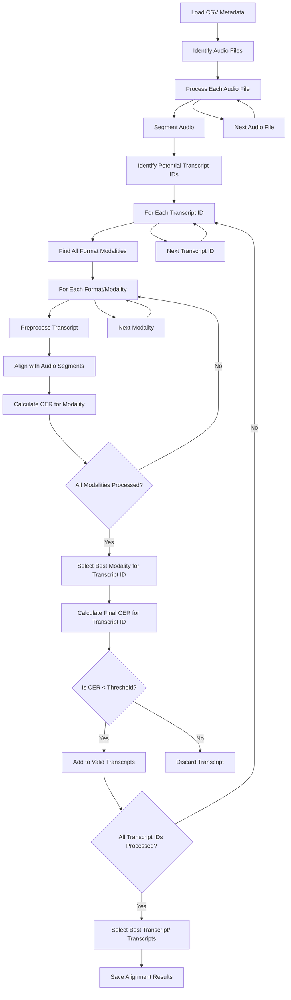

# Alignment Pipeline

The Alignment Pipeline is the core orchestration component of the Parliament Transcript Aligner system. It manages the process of aligning audio recordings with their corresponding transcripts across multiple formats and sources.

## Overview

The pipeline handles:
1. Reading CSV metadata files to identify matching audio-transcript pairs
2. Processing audio files through segmentation
3. Finding and preprocessing matching transcripts
4. Aligning audio segments with transcripts through a two-level selection process:
   - First, selecting the best modality (format) for each transcript ID
   - Then, selecting the best transcript ID(s) among potential matches
5. Selecting the best matching transcript based on Character Error Rate (CER)
6. Outputting alignment results

## System Context

### Directory Structure

Parliamentary data is organized in a specific directory structure:


BASE_DIR/
├── downloaded_audio/ # All audio content
│ ├── mp4_converted/ # MP4 videos converted to audio
│ ├── youtube_converted/ # YouTube videos converted to audio
│ ├── m3u8_streams/ # Streaming content converted to audio
│ └── generic_video/ # Other video formats converted to audio
├── downloaded_transcript/ # All transcript content
│ ├── pdf_transcripts/ # PDF format transcripts
│ ├── html_transcripts/ # HTML format transcripts
│ ├── dynamic_html_transcripts/ # Dynamically loaded HTML transcripts
│ ├── processed_html_transcripts/ # Custom processed HTML transcripts
│ └── processed_text_transcripts/ # Custom processed text transcripts
└── downloaded_subtitle/ # All subtitle content
└── srt_subtitles/ # SRT format subtitles

### Metadata CSV Format

Metadata is typically provided in CSV files that map audio/video IDs to transcript IDs:

#### Format 1:
```
html_link,processed_video_link,transcript_id,year,part
https://www.ft.dk/forhandlinger/20101/20101M108_2011-07-01_1000.htm,https://www.ft.dk/aktuelt/webtv/video/20101/salen/108.aspx,20101M108_2011-07-01_1000,2010,1
```

#### Format 2:
```
video_id,transcript_id,processed_video_link,html_link,match_type,video_date,video_time,video_legislation,video_title
20210107103401,2173,https://cdn.tiesraides.lv/saeima.lv/20210107103401_saeima.lv.1_0_0,https://www.saeima.lv/lv/transcripts/view/2173,webpage,2021-01-07,9.20,13,
```

## ID Mapping Scenarios

File naming follows these patterns:
1. When both `video_id` and `transcript_id` exist:
   - Audio files are stored with `video_id` as filename
   - Transcript files are stored with `transcript_id` as filename
   - In some cases, files might be stored with a combination of both IDs

2. When only one ID exists:
   - Both audio and transcript files use the same ID (either `video_id` or `transcript_id`)

## Alignment Process Flow



## Two-Level Selection Process

### Level 1: Modality Selection for Each Transcript ID
For each potential transcript ID that might match an audio file:
1. Locate all format modalities available (.pdf, .html, .txt, .srt)
2. Process and align each modality with the audio
3. Select the best modality based on lowest median CER
4. This selection ensures we only use the best representation of each transcript

### Level 2: Transcript ID Selection
After selecting the best modality for each transcript ID:
1. Compare the best-performing modalities of different transcript IDs
2. Apply the selection strategy (best only, threshold-based, etc.)
3. Select the final transcript(s) to be used for the audio file

## Implementation Approach

### Step 1: CSV Metadata Processing
- Load CSV file(s)
- Parse and validate required fields (video_id, transcript_id, etc.)
- Build a mapping of audio files to potential transcript IDs

### Step 2: Audio Processing
- For each audio file:
  - Check if segmentation cache exists
  - If not, segment audio using AudioSegmenter
  - Cache segmentation results

### Step 3: Transcript Identification
- For each audio file:
  - Identify all potential transcript IDs based on CSV data
  - For each transcript ID, find all available format modalities across transcript directories

### Step 4: Modality Selection (Level 1)
- For each transcript ID:
  - For each format modality:
    - Preprocess the transcript using the appropriate TranscriptPreprocessor
    - Align with audio segments using TranscriptAligner
    - Calculate median CER
  - Select the format modality with the lowest median CER
  - Store this as the "best representation" of this transcript ID

### Step 5: Transcript Selection (Level 2)
- Compare all "best representations" of different transcript IDs
- Apply the configured selection strategy:
  - `best_only`: Keep only the transcript ID with the lowest median CER
  - `threshold_all`: Keep all transcript IDs with median CER below threshold
  - `force_all`: Keep all transcript IDs regardless of CER

### Step 6: Output
- Save alignment results for selected transcript(s)
- Include metadata about the selection process


### Current CSV Processing Implementation

The current implementation processes CSV files as follows:

1. Loads the CSV file using Python's `csv.DictReader`
2. For each row:
   - Extracts `video_id` directly from the column if available
   - If `video_id` is missing but `processed_video_link` exists, attempts to extract the ID from the URL (taking the last path component)
   - Extracts `transcript_id` from the column if available
   - If no `transcript_id` is found, uses `video_id` as the transcript ID
   - Builds a dictionary mapping each `video_id` to a list of potential `transcript_id`s

This approach has some limitations:
- It assumes consistent column naming across different CSV formats
- URL parsing is very basic and might not work for all URL patterns
- It doesn't handle all the possible relationships between video and transcript IDs

**Future improvements needed:**
- More robust URL parsing for different parliament websites
- Support for explicit mapping configuration for different CSV formats
- Ability to handle additional metadata fields that might be useful for filtering or reporting

## ID Mapping Scenarios

File naming follows these patterns:
1. When both `video_id` and `transcript_id` exist:
   - Audio files are stored with `video_id` as filename
   - Transcript files are stored with `transcript_id` as filename
   - In some cases, files might be stored with a combination of both IDs

2. When only one ID exists:
   - Both audio and transcript files use the same ID (either `video_id` or `transcript_id`)

## Alignment Process Flow


## Two-Level Selection Process

### Level 1: Modality Selection for Each Transcript ID
For each potential transcript ID that might match an audio file:
1. Locate all format modalities available (.pdf, .html, .txt, .srt)
2. Process and align each modality with the audio
3. Select the best modality based on lowest median CER
4. This selection ensures we only use the best representation of each transcript

### Level 2: Transcript ID Selection
After selecting the best modality for each transcript ID:
1. Compare the best-performing modalities of different transcript IDs
2. Apply the configured selection strategy (best only, threshold-based, etc.)
3. Select the final transcript(s) to be used for the audio file

## Implementation Approach

### Step 1: CSV Metadata Processing
- Load CSV file(s)
- Parse and validate required fields (video_id, transcript_id, etc.)
- Build a mapping of audio files to potential transcript IDs

### Step 2: Audio Processing
- For each audio file:
  - Check if segmentation cache exists
  - If not, segment audio using AudioSegmenter
  - Cache segmentation results

### Step 3: Transcript Identification
- For each audio file:
  - Identify all potential transcript IDs based on CSV data
  - For each transcript ID, find all available format modalities across transcript directories

### Step 4: Modality Selection (Level 1)
- For each transcript ID:
  - For each format modality:
    - Preprocess the transcript using the appropriate TranscriptPreprocessor
    - Align with audio segments using TranscriptAligner
    - Calculate median CER
  - Select the format modality with the lowest median CER
  - Store this as the "best representation" of this transcript ID

### Step 5: Transcript Selection (Level 2)
- Compare all "best representations" of different transcript IDs
- Apply the configured selection strategy:
  - `best_only`: Keep only the transcript ID with the lowest median CER
  - `threshold_all`: Keep all transcript IDs with median CER below threshold
  - `force_all`: Keep all transcript IDs regardless of CER

### Step 6: Output
- Save alignment results for selected transcript(s)
- Include metadata about the selection process

## Configuration Parameters

The AlignmentPipeline should be configurable with parameters like:

- `base_dir`: Root directory containing all data
- `csv_path`: Path to CSV metadata file
- `audio_dirs`: List of directories to search for audio files
- `transcript_dirs`: List of directories to search for transcript files
- `output_dir`: Directory to save alignment results
- `cer_threshold`: Maximum acceptable median CER for valid alignments
- `cache_dir`: Directory for caching intermediate results
- `use_cache`: Whether to use cached results when available
- `multi_transcript_strategy`: How to handle multiple transcripts per audio
  - `best_only`: Keep only the transcript with lowest CER
  - `threshold_all`: Keep all transcripts below CER threshold
  - `force_all`: Keep all transcripts regardless of CER

## Results Output Format

The pipeline produces two types of output files:

1. **Summary JSON** (`{video_id}_alignment_summary.json`):
   - Contains video ID, audio path, and a list of selected transcripts
   - Each transcript entry includes transcript ID, format type, CER value, and segment count
   - Does not include the full aligned segments to keep file size manageable

2. **Detailed Alignments** (`{video_id}_{transcript_id}_aligned.json`):
   - One file per selected transcript
   - Contains the complete alignment data including all segments
   - Includes both ASR text and human transcript text for each segment

## Usage Example

```python
from parliament_transcript_aligner.pipeline import AlignmentPipeline

pipeline = AlignmentPipeline(
    base_dir="/path/to/data",
    csv_path="/path/to/metadata.csv",
    output_dir="/path/to/output",
    cer_threshold=0.3,
    multi_transcript_strategy="best_only"
)

# Process all files in the CSV
pipeline.process_all()

# Or process a specific subset
pipeline.process_subset(video_ids=["20210107103401"])
```

## Implementation Considerations and Assumptions

### Assumptions
1. Audio files are in .opus format
2. Transcript files are in formats supported by our preprocessors (.pdf, .html, .txt, .srt)
3. For each transcript ID, the best representation is the modality with lowest median CER
4. For each audio file, one or more transcript IDs may be valid matches
5. In most cases, one format modality should be selected per transcript ID

### When to Revisit Assumptions
- **CSV Format Handling**: The current CSV processing may need to be enhanced for different parliament data formats
- **Multiple Modalities Needed**: In rare cases, different modalities of the same transcript ID might contain complementary information and should be combined
- **Multiple Correct Transcripts**: If transcripts represent different parts of the same audio, consider using time information if available or developing a specialized alignment strategy
- **Format-Specific Handling**: Some transcript formats might need special handling beyond basic preprocessing
- **Language Detection**: For multilingual parliaments, language detection might be needed to select appropriate ASR models
- **Different CER Metrics**: If median CER is not sufficient for selection, consider alternative statistics like mean, weighted average, or distribution analysis

### Potential Extensions
- **Parallel Processing**: For large datasets, implement parallel processing of multiple audio files
- **Incremental Processing**: Support for processing only new or modified files
- **Progress Tracking**: Add logging and progress tracking for long-running processes
- **Error Recovery**: Implement error handling and recovery mechanisms for partial failures
- **Combined Transcript Creation**: Ability to merge multiple high-quality transcripts that cover different parts of the same audio

## Configuration Parameters

The AlignmentPipeline should be configurable with parameters like:

- `base_dir`: Root directory containing all data
- `csv_path`: Path to CSV metadata file
- `audio_dirs`: List of directories to search for audio files
- `transcript_dirs`: List of directories to search for transcript files
- `output_dir`: Directory to save alignment results
- `cer_threshold`: Maximum acceptable median CER for valid alignments
- `cache_dir`: Directory for caching intermediate results
- `use_cache`: Whether to use cached results when available
- `multi_transcript_strategy`: How to handle multiple transcripts per audio
  - `best_only`: Keep only the transcript with lowest CER
  - `threshold_all`: Keep all transcripts below CER threshold
  - `force_all`: Keep all transcripts regardless of CER

## Usage Example

```python
from parliament_transcript_aligner.pipeline import AlignmentPipeline

pipeline = AlignmentPipeline(
    base_dir="/path/to/data",
    csv_path="/path/to/metadata.csv",
    output_dir="/path/to/output",
    cer_threshold=0.3,
    multi_transcript_strategy="best_only"
)

# Process all files in the CSV
pipeline.process_all()

# Or process a specific subset
pipeline.process_subset(video_ids=["20210107103401"])
```

## Implementation Considerations and Assumptions

### Assumptions
1. Audio files are in .opus format
2. Transcript files are in formats supported by our preprocessors (.pdf, .html, .txt, .srt)
3. For each transcript ID, the best representation is the modality with lowest median CER
4. For each audio file, one or more transcript IDs may be valid matches
5. In most cases, one format modality should be selected per transcript ID

### When to Revisit Assumptions
- **Multiple Modalities Needed**: In rare cases, different modalities of the same transcript ID might contain complementary information and should be combined
- **Multiple Correct Transcripts**: If transcripts represent different parts of the same audio, consider using time information if available or developing a specialized alignment strategy
- **Format-Specific Handling**: Some transcript formats might need special handling beyond basic preprocessing
- **Language Detection**: For multilingual parliaments, language detection might be needed to select appropriate ASR models
- **Different CER Metrics**: If median CER is not sufficient for selection, consider alternative statistics like mean, weighted average, or distribution analysis

### Potential Extensions
- **Parallel Processing**: For large datasets, implement parallel processing of multiple audio files
- **Incremental Processing**: Support for processing only new or modified files
- **Progress Tracking**: Add logging and progress tracking for long-running processes
- **Error Recovery**: Implement error handling and recovery mechanisms for partial failures
- **Combined Transcript Creation**: Ability to merge multiple high-quality transcripts that cover different parts of the same audio

