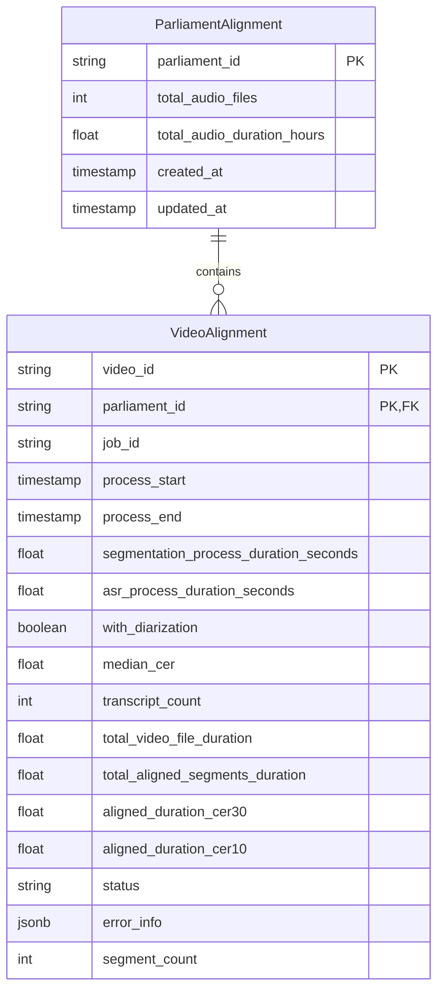

# Supabase Logging for Parliament Transcript Aligner

This document describes the Supabase logging functionality for the Parliament Transcript Aligner pipeline.

## Overview

The `SupabaseClient` class provides methods to log alignment operations and metrics to a Supabase database. It allows tracking the progress of audio/video alignment processes, recording performance metrics, and storing error information.

## Database Schema



## Status Constants

The system uses the following status constants to track the alignment process:

| Status | Description |
|--------|-------------|
| `STATUS_INITIALIZING` | Entry just created |
| `STATUS_SEGMENTING` | Audio segmentation in progress |
| `STATUS_SEGMENTING_COMPLETE` | Audio segmentation completed |
| `STATUS_TRANSCRIBING` | ASR processing in progress |
| `STATUS_TRANSCRIBING_COMPLETE` | ASR processing completed |
| `STATUS_COMPLETED` | Alignment successfully completed |
| `STATUS_FAILED` | Alignment failed |

## Core Functionality

### Parliament Management

The client provides methods to create and manage parliament entries:

- `create_parliament_entry(total_audio_files, total_audio_duration_hours)`: Creates a new parliament entry if it doesn't exist

### Video Alignment Tracking

The following methods track the alignment process for a specific video:

- `start_video_alignment(video_id, job_id)`: Records the start of the alignment process
- `update_segmentation_complete(video_id, duration_seconds, segment_count)`: Records segmentation completion with metrics
- `update_transcribing_start(video_id)`: Records the start of the transcription process
- `update_transcribing_complete(video_id, duration_seconds)`: Records ASR completion with duration
- `complete_video_alignment(video_id, metrics, with_diarization, enable_subset)`: Records successful alignment with all metrics
- `fail_video_alignment(video_id, error_info)`: Records failed alignment with error details

## Alignment Metrics

The `AlignmentMetrics` class tracks performance metrics for the alignment process:

- `median_cer`: Median Character Error Rate
- `transcript_count`: Number of transcripts
- `total_video_file_duration`: Total duration of the video file
- `total_aligned_segments_duration`: Total duration of aligned segments
- `aligned_duration_cer30`: Duration of segments with CER <= 0.3
- `aligned_duration_cer10`: Duration of segments with CER <= 0.1

## Type Validation

The client includes validation for the following:

- Field presence: Ensures all required fields are present unless explicitly allowing subsets
- Type checking: Validates that field values match their expected types
- Field validation: Prevents unexpected fields from being added to the database

## Usage Example

```python
from parliament_transcript_aligner.utils.logging.supabase_logging import get_supabase, AlignmentMetrics

# Initialize client with parliament_id
supabase = get_supabase(parliament_id="uk_parliament")

# Create parliament entry
supabase.create_parliament_entry(
    total_audio_files=1250,
    total_audio_duration_hours=3500.5
)

# Start video alignment
video_id = "session_2023_04_15"
supabase.start_video_alignment(
    video_id=video_id,
    job_id="batch_20230415"
)

# Record segmentation completion
supabase.update_segmentation_complete(
    video_id=video_id,
    duration_seconds=120.5,
    segment_count=45
)

# Start transcription
supabase.update_transcribing_start(video_id=video_id)

# Record transcription completion
supabase.update_transcribing_complete(
    video_id=video_id,
    duration_seconds=350.2
)

# Record successful completion
metrics = AlignmentMetrics(
    median_cer=0.12,
    transcript_count=2,
    total_video_file_duration=1800.0,
    total_aligned_segments_duration=1750.5,
    aligned_duration_cer30=1500.0,
    aligned_duration_cer10=800.0
)
supabase.complete_video_alignment(
    video_id=video_id,
    metrics=metrics,
    with_diarization=True
)

# Handle failure case
try:
    # Some alignment code
    pass
except Exception as e:
    supabase.fail_video_alignment(
        video_id=video_id,
        error_info={"error_type": str(type(e)), "message": str(e)}
    )
```

## Error Handling

The client includes comprehensive error handling:

- `SupabaseClientError`: Custom exception for Supabase-related errors
- Validation errors: Raised when invalid data is provided
- Detailed logging: All operations and errors are logged using Python's logging system